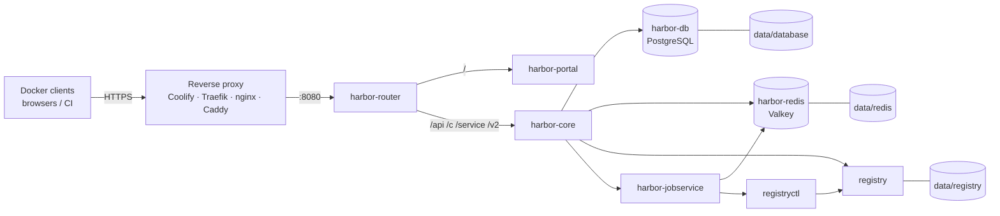

<div align="center">

# Self-Hosted Harbor Registry

**A hardened, production-ready private Docker registry — [Harbor](https://goharbor.io) v2.15.2 on Docker Compose.**

No published ports · no secrets in the compose file · one command to bootstrap

[](https://github.com/ub360-ai/Self-Host-Docker-Images/stargazers)
[](https://github.com/ub360-ai/Self-Host-Docker-Images/forks)
[](https://github.com/ub360-ai/Self-Host-Docker-Images/watchers)
[](https://github.com/ub360-ai/Self-Host-Docker-Images/issues)
[](https://github.com/ub360-ai/Self-Host-Docker-Images/commits/main)
[](https://github.com/ub360-ai/Self-Host-Docker-Images/graphs/contributors)
[](LICENSE)
[](https://github.com/ub360-ai/Self-Host-Docker-Images/pulls)
[](https://goharbor.io)
[](https://docs.docker.com/compose/)
[](#use-cases)

</div>

---

Harbor is a full private container registry: web UI, projects, role-based
access control, robot accounts, quotas, replication, webhooks and garbage
collection. This repository packages it as a **single-host Docker Compose
stack** with security and operations in mind — suitable for a company, a
homelab or a CI image cache.

Everything that can be sensitive lives outside the compose file: credentials
are generated by a bootstrap script, injected through fail-fast environment
variables, and written to `git`-ignored paths.

## Table of contents

- [Highlights](#highlights)
- [Architecture](#architecture)
- [Requirements](#requirements)
- [Quick start (local)](#quick-start-local)
- [Push and pull images](#push-and-pull-images)
- [Production deployment](#production-deployment)
- [Use cases](#use-cases)
- [Repository layout](#repository-layout)
- [Configuration reference](#configuration-reference)
- [Operations](#operations)
- [Security model](#security-model)
- [Known limitations](#known-limitations)
- [Troubleshooting](#troubleshooting)
- [Contributing](#contributing)
- [License](#license)
- [Credits](#credits)

## Highlights

- **No secrets in the compose file.** Every credential is injected via
  `${VAR:?}` environment variables; the stack refuses to start if one is
  missing.
- **One-command bootstrap.** `scripts/gen-secrets.sh` generates every
  password, the RSA-4096 token-signing key, the 16-character encryption key,
  the registry htpasswd file and the jobservice config — then fixes ownership
  of the runtime directories.
- **No published ports by default.** The stack is reachable only through a
  reverse proxy that joins the Docker network.
- **Internal ingress router.** `harbor-router` fans out `/` to the portal and
  `/api`, `/c`, `/service`, `/v2` to core, so a proxy only needs one upstream.
- **Hardened Redis.** Password protected, memory capped and LRU-evicting.
- **Fully configurable limits.** CPU, memory, reservations and PID limits per
  service, all via environment variables.
- **Volume mappings in the env file.** Each Docker volume is one complete
  mapping (`source:target[:mode]`), so Coolify and other Compose consumers
  read them cleanly. Put the database, registry blobs or any config file
  wherever you want.
- **Health checks and ordering.** Database and Redis must be healthy before
  core starts; the registry before core proxies to it.
- **`no-new-privileges`** on every service, json-file log rotation, graceful
  shutdown for PostgreSQL.
- **Coolify-ready.** A generated `docker-compose.coolify.yml` with literal
  `/data/harbor` mounts works around Coolify's volume-variable restriction; set
  one domain on `harbor-router` and let Coolify's Traefik terminate TLS.
- **Local-first developer loop.** A committed override example publishes the
  router on `127.0.0.1:8080` for browser and `docker` CLI testing.

## Architecture



**How a push/pull works**

1. A Docker client authenticates through the reverse proxy → `harbor-router`
   → `harbor-core` (`/service/token`), which validates the user against
   PostgreSQL and issues a signed token.
2. `/v2/` requests are proxied by core to the `registry` container using an
   internal credential that only core and jobservice know (bcrypt htpasswd).
3. Blobs land in `data/registry`; repository, tag and quota metadata live in
   PostgreSQL; sessions and the job queue live in Redis.
4. Garbage collection runs through `registryctl`, orchestrated by
   `harbor-jobservice`.

## Requirements

- Linux host (recommended) with **Docker Engine 24+** and **Docker Compose v2**
- `openssl` (secret and key generation)
- `git`
- One of `htpasswd`, `python3` with the `bcrypt` module, or Docker (fallback
  for generating the registry password file — Docker is always available when
  you run this stack)
- ~2 vCPU / 4 GB RAM for the default minimal resource limits

Docker Desktop on macOS/Windows works for local testing; file ownership
handling in the bootstrap script is designed for Linux hosts.

## Quick start (local)

```bash
git clone https://github.com/ub360-ai/Self-Host-Docker-Images.git
cd Self-Host-Docker-Images

# 1. Create the local environment and generate all secrets
cp .env.example .env
./scripts/gen-secrets.sh .env

# 2. Publish the router on loopback (127.0.0.1:8080) for browser access
cp docker-compose.override.yml.example docker-compose.override.yml

# 3. Start the stack
docker compose --env-file .env up -d

# 4. Open the UI
#    http://localhost:8080
#    user: admin   password:
grep '^HARBOR_ADMIN_PASSWORD=' .env
```

Or with the bundled Makefile:

```bash
make env       # create .env from the example
make secrets   # generate secrets, keys and directories
make dev-up    # copy the local override and start
make ps        # container status
```

The base compose publishes **no ports**. The local override exists only to
expose `harbor-router` on `127.0.0.1:8080`; remove it to run exactly what a
production proxy would see.

## Push and pull images

```bash
# Log in (Docker treats localhost registries as insecure, so plain HTTP is fine)
grep '^HARBOR_ADMIN_PASSWORD=' .env | cut -d= -f2- \
  | docker login localhost:8080 -u admin --password-stdin

# Push an image into a project (library exists by default)
docker tag alpine:3 localhost:8080/library/alpine:3
docker push localhost:8080/library/alpine:3

# Pull it back
docker pull localhost:8080/library/alpine:3
```

Create additional projects in the UI (**Projects → New Project**) or via the
API, then push to `localhost:8080/<project>/<image>:<tag>`.

## Production deployment

### Reverse proxy routing

Point your proxy at **one upstream** and let the router split the paths:

| Public path | Upstream |
|---|---|
| `/` | `harbor-router:8080` |
| `/api/`, `/c/`, `/service/`, `/v2/` | `harbor-router:8080` (router forwards to core) |

TLS terminates at the proxy. Set `EXTERNAL_URL` and `PORTAL_URL` to the public
HTTPS URL — Harbor derives redirects and the Docker token realm from it.

### Coolify

Coolify's compose parser rejects variables inside volume definitions
([coollabsio/coolify#7127](https://github.com/coollabsio/coolify/issues/7127)),
so this repository ships a Coolify-ready variant with literal absolute bind
mounts under `/data/harbor`: [`docker-compose.coolify.yml`](docker-compose.coolify.yml).
It is generated from `docker-compose.yml` by `scripts/render-coolify-compose.sh`
(`make coolify-compose`).

1. Push this repository to a private Git remote and create a Coolify resource
   with the **Docker Compose** build pack. Set **Docker Compose Location** to
   `docker-compose.coolify.yml`.
2. Add every required variable (see
   [`.env.production.example`](.env.production.example)) in Coolify's
   **Environment Variables**. The `HARBOR_*_VOLUME` variables are not
   referenced by the Coolify compose, so Coolify will not ask for them. Set at
   least:
   - `EXTERNAL_URL` / `PORTAL_URL` = `https://registry.example.com`
   - `COMPOSE_PROJECT_NAME` = `harbor`
3. Set the domain on the **`harbor-router`** service:
   `https://registry.example.com:8080` (the suffix is the internal port).
4. On the VPS, prepare `/data/harbor` once before the first deploy:

   ```bash
   sudo mkdir -p /data/harbor
   rsync -avz config/ root@<host>:/data/harbor/config/
   cp .env.production.example .env.production   # paths already use /data/harbor
   ./scripts/gen-secrets.sh .env.production
   ```

   Then paste the generated secret values into Coolify and deploy. Because
   every mount is absolute, redeploys cannot wipe data or configs.

### Generic host (nginx/Caddy + Compose)

```bash
sudo mkdir -p /data/harbor
rsync -avz config/ root@<host>:/data/harbor/config/   # or run the rest on the host
cp .env.production.example .env.production
$EDITOR .env.production          # URLs, limits
./scripts/gen-secrets.sh .env.production
docker compose --env-file .env.production up -d
```

### Getting config files to the host

Each config file has its own volume mapping variable in the main compose
(the Coolify variant uses literal `/data/harbor/config/...` paths):

| File | Variable | Mounted into |
|---|---|---|
| `config/nginx/router.conf` | `HARBOR_ROUTER_CONFIG_VOLUME` | `harbor-router` |
| `config/portal/nginx.conf` | `HARBOR_PORTAL_CONFIG_VOLUME` | `harbor-portal` |
| `config/registry/config.yml` | `HARBOR_REGISTRY_CONFIG_VOLUME` | `registry`, `registryctl` |
| `config/registryctl/config.yml` | `HARBOR_REGISTRYCTL_CONFIG_VOLUME` | `registryctl` |
| `config/jobservice/config.yml.tmpl` | `HARBOR_JOBSERVICE_TEMPLATE` | read by `gen-secrets.sh` |

- **Absolute layout (Coolify / production example):** copy the files once with
  `rsync -avz config/ root@host:/data/harbor/config/` and keep the variables at
  `/data/harbor/config/...`. This survives redeploys that wipe the repository
  directory.
- **Repo-relative layout:** set the config volume variables to `./config/...`
  and keep the repository checkout on the host (Coolify: enable *Preserve
  Repository During Deployment*).

## Use cases

- **Company private registry** — projects per team, RBAC, robot accounts for
  CI, quotas and audit-friendly metadata.
- **Homelab** — a clean UI and API for images you do not want to push to
  Docker Hub.
- **CI/CD image cache** — push build artifacts once, pull them everywhere;
  Harbor also supports proxy-cache projects for upstream registries.
- **Release distribution** — immutable tags per release, e.g.
  `registry.example.com/team/app:v2.2.6`.
- **Kubernetes clusters** — robot accounts with pull-only credentials for
  `imagePullSecrets`.
- **Coolify / PaaS deployments** — one domain, TLS handled by the platform
  proxy.

## Repository layout

```
.
├── docker-compose.yml               # generic stack, env-driven volumes
├── docker-compose.coolify.yml       # Coolify variant (literal /data/harbor mounts, generated)
├── docker-compose.override.yml.example  # local loopback ingress (gitignored when copied)
├── config/
│   ├── nginx/router.conf            # internal path routing
│   ├── portal/nginx.conf            # static UI server
│   ├── registry/config.yml          # distribution registry
│   ├── registryctl/config.yml       # garbage collection controller
│   └── jobservice/config.yml.tmpl   # rendered with the Redis URL by the script
├── scripts/
│   ├── gen-secrets.sh               # secret + key bootstrap
│   └── render-coolify-compose.sh    # generates docker-compose.coolify.yml
├── .env.example                     # runnable local template
├── .env.production.example          # production template
├── Makefile                         # common operations
├── SECURITY.md
└── CHANGELOG.md
```

## Configuration reference

The full list with inline documentation lives in
[`.env.example`](.env.example) and [`.env.production.example`](.env.production.example).
Highlights:

### Application

| Variable | Description | Default |
|---|---|---|
| `HARBOR_VERSION` | Harbor image tag | `v2.15.2` |
| `COMPOSE_PROJECT_NAME` | Compose project name | `harbor-local` |
| `TZ` | Container timezone | `UTC` |
| `LOG_LEVEL` | `debug`, `info`, `warning`, `error` | `info` |

### Public URLs

| Variable | Description |
|---|---|
| `EXTERNAL_URL` | Public URL, e.g. `https://registry.example.com` |
| `PORTAL_URL` | Public portal URL (usually the same) |

### Storage

Every Docker volume is one **complete mapping variable** in the env file —
`<host-source>:<container-target>[:mode]` — and `docker-compose.yml`
references exactly one variable per volume. **Only edit the host source**:
the container targets and `:ro` modes are required by the images, and
`gen-secrets.sh` warns if they change.

The Coolify variant (`docker-compose.coolify.yml`) hardcodes these mappings
under `/data/harbor` because Coolify rejects variables in volume definitions.

| Variable | Mapping (local) |
|---|---|
| `HARBOR_DATA_VOLUME` | `./data:/data` |
| `HARBOR_DB_VOLUME` | `./data/database:/var/lib/postgresql/data` |
| `HARBOR_REDIS_VOLUME` | `./data/redis:/var/lib/redis` |
| `HARBOR_REGISTRY_DATA_VOLUME` | `./data/registry:/storage` |
| `HARBOR_JOB_LOGS_VOLUME` | `./data/job_logs:/var/log/jobs` |
| `HARBOR_CA_DOWNLOAD_VOLUME` | `./data/ca_download:/etc/core/ca` |
| `HARBOR_CORE_PRIVATE_KEY_VOLUME` | `./data/secret/core/private_key.pem:/etc/core/private_key.pem:ro` |
| `HARBOR_CORE_SECRET_KEY_VOLUME` | `./data/secret/keys/secretkey:/etc/core/key:ro` |
| `HARBOR_REGISTRY_PASSWD_VOLUME` | `./data/secret/registry/passwd:/etc/registry/passwd:ro` |
| `HARBOR_JOBSERVICE_CONFIG_VOLUME` | `./data/secret/jobservice/config.yml:/etc/jobservice/config.yml:ro` |
| `HARBOR_PORTAL_CONFIG_VOLUME` | `./config/portal/nginx.conf:/etc/nginx/nginx.conf:ro` |
| `HARBOR_ROUTER_CONFIG_VOLUME` | `./config/nginx/router.conf:/etc/nginx/conf.d/default.conf:ro` |
| `HARBOR_REGISTRY_CONFIG_VOLUME` | `./config/registry/config.yml:/etc/registry/config.yml:ro` |
| `HARBOR_REGISTRYCTL_CONFIG_VOLUME` | `./config/registryctl/config.yml:/etc/registryctl/config.yml:ro` |
| `HARBOR_JOBSERVICE_TEMPLATE` | `./config/jobservice/config.yml.tmpl` (path only, script) |

### Credentials

| Variable | Notes |
|---|---|
| `POSTGRES_DB` / `POSTGRES_USER` | Database name and user |
| `POSTGRES_PASSWORD` | Database password (generated) |
| `REDIS_PASSWORD` | Redis password (generated) |
| `REDIS_URL` | Full authenticated Redis URL used by core and jobservice (generated) |
| `HARBOR_ADMIN_PASSWORD` | Initial `admin` password (generated, policy-compliant) |
| `CORE_SECRET` / `JOBSERVICE_SECRET` | Inter-service secrets (generated) |
| `CSRF_KEY` | Must be exactly 32 characters (generated) |
| `REGISTRY_USERNAME` / `REGISTRY_PASSWORD` | Internal core → registry credential (generated) |
| `REGISTRY_HTTP_SECRET` | Registry state-signing secret (generated) |

### Tuning

| Variable | Description | Default |
|---|---|---|
| `HARBOR_DB_SHM_SIZE` | PostgreSQL shared memory | `256m` |
| `HARBOR_REDIS_MAX_MEMORY` | Redis maxmemory (keep below the container limit) | `192M` |
| `MAX_JOB_WORKERS` | Jobservice worker count | `10` |
| `LOG_MAX_SIZE` / `LOG_MAX_FILE` | json-file rotation | `10m` / `3` |
| `HARBOR_NETWORK_NAME` | Docker network name | `harbor-internal` |

### Resource limits

Every service accepts the same five variables — replace `<SERVICE>` with
`HARBOR_DB`, `HARBOR_REDIS`, `HARBOR_PORTAL`, `HARBOR_CORE`,
`HARBOR_REGISTRY`, `HARBOR_JOBSERVICE`, `HARBOR_REGISTRYCTL` or
`HARBOR_ROUTER`:

```
<SERVICE>_CPU_LIMIT
<SERVICE>_MEMORY_LIMIT
<SERVICE>_CPU_RESERVATION
<SERVICE>_MEMORY_RESERVATION
<SERVICE>_PIDS_LIMIT
```

## Operations

### Status and logs

```bash
make ps          # docker compose ps
make logs        # follow logs
make config      # validate the rendered configuration
```

### Create a project

UI: **Projects → New Project**. API:

```bash
curl -u admin:"$HARBOR_ADMIN_PASSWORD" -X POST \
  -H 'Content-Type: application/json' \
  -d '{"project_name":"team","public":false}' \
  https://registry.example.com/api/v2.0/projects
```

### Backups

```bash
make db-backup   # consistent PostgreSQL dump into ./backups
make backup      # tar of the whole runtime data directory into ./backups
```

Store backups (and a copy of your `.env`) in a secret manager, never in git.

### Garbage collection

Harbor runs GC through `registryctl`. Trigger it from
**Projects → <project> → Garbage Collection**, or via the API. GC is
asynchronous; watch progress in the UI.

### Upgrade Harbor

1. Back up (see above).
2. Set `HARBOR_VERSION` to the new tag in your env file.
3. `docker compose --env-file .env up -d` — core applies database migrations
   on startup.

Pin a tested version; avoid moving tags in production.

### Rotate secrets

- **Admin password:** change it in the UI (**Administration → Users**) after
  first login.
- **Database password:** update the PostgreSQL role, then `POSTGRES_PASSWORD`
  and restart core.
- **`CORE_SECRET` / `JOBSERVICE_SECRET` / `REGISTRY_HTTP_SECRET`:** update the
  env file and recreate the affected services (`core`, `jobservice`,
  `registry`).
- **Key material:** `./scripts/gen-secrets.sh .env --force` regenerates keys;
  note that regenerating the token key invalidates issued Docker tokens and
  regenerating the encryption key affects encrypted data — plan a maintenance
  window.

## Security model

What this stack does for you:

- Secrets never live in `docker-compose.yml`; missing values abort the deploy.
- Only the reverse proxy should join the Docker network — no ports are
  published by default.
- Redis requires a password; the registry trusts only core's internal
  credential (bcrypt htpasswd).
- The token-signing key (RSA-4096) and the core encryption key are generated
  on the host and mounted read-only.
- `no-new-privileges` on every container, health checks, log rotation and
  resource limits are enabled by default.
- `.env*` and `/data/` are gitignored; the bootstrap script never prints
  secret values.

What it does **not** do:

- No vulnerability scanning (Harbor's Trivy adapter is not included).
- No high availability — single host, single PostgreSQL/Redis instance.
- No external database/Redis support out of the box.
- No log shipping or metrics exporter.

For coordinated disclosure of security issues, see [SECURITY.md](SECURITY.md).

## Known limitations

- Fixed `container_name`s mean one stack per Docker host (or rename them).
- The internal network is a single bridge; the reverse proxy can reach all
  services on it. Only trusted proxies should join.
- The default resource limits are deliberately minimal for small hosts — tune
  them for production.
- The local override binds to `127.0.0.1` only; it is not reachable from the
  LAN by design.

## Troubleshooting

**`docker login` asks for `http://<host>/service/token` without the port**
Your proxy is stripping the port from the `Host` header. `config/nginx/router.conf`
uses `$http_host` on purpose; make sure your proxy forwards the original Host
(and `X-Forwarded-Proto`).

**The UI loads but API calls fail / redirects go to the wrong host**
`EXTERNAL_URL` / `PORTAL_URL` must match the URL in the browser exactly
(scheme included). Recreate `harbor-core` after changing them.

**`not a directory` or containers exit on first boot**
Run `./scripts/gen-secrets.sh <env-file>` **before** starting the stack. File
bind mounts require the key material to exist; otherwise Docker creates a
directory in place of a file.

**Permission denied on `data/` directories**
The script sets ownership to `999:999` (PostgreSQL/Valkey) and `10000:10000`
(harbor) using a helper container. Run it with Docker access.

**`harbor-router` stays unhealthy**
The health check uses `127.0.0.1` because `localhost` may resolve to IPv6
inside the container while nginx listens on IPv4.

**Pushing from a remote machine fails over HTTP**
Docker only treats `localhost` as insecure by default. Use TLS, or add your
registry to `insecure-registries` for testing.

**Coolify: mounts break after redeploy**
Enable *Preserve Repository During Deployment*, or copy the configs to an
absolute path and point the config volume host sources there (for example
`HARBOR_ROUTER_CONFIG_VOLUME=/data/harbor/config/nginx/router.conf:/etc/nginx/conf.d/default.conf:ro`).

**Garbage collection does nothing**
Confirm `registryctl` is healthy (`make ps`) and that core was started with
`REGISTRY_CONTROLLER_URL` (it is set in the compose file by default).

## Contributing

Issues and pull requests are welcome.

- Keep secrets out of the repository — see [SECURITY.md](SECURITY.md).
- Validate changes with `make config` and, when possible, a local smoke test
  (push and pull an image through `127.0.0.1:8080`).
- Update [CHANGELOG.md](CHANGELOG.md) for user-visible changes.

## License

[MIT](LICENSE) © ub360-ai and contributors.

Harbor itself is licensed under [Apache-2.0](https://github.com/goharbor/harbor/blob/main/LICENSE).

## Credits

- [Harbor](https://goharbor.io) by the Cloud Native Computing Foundation
- [PostgreSQL](https://www.postgresql.org), [Valkey](https://valkey.io), [nginx](https://nginx.org)
- The Docker Compose and self-hosting communities

## Star history

[](https://star-history.com/#ub360-ai/Self-Host-Docker-Images&Date)
